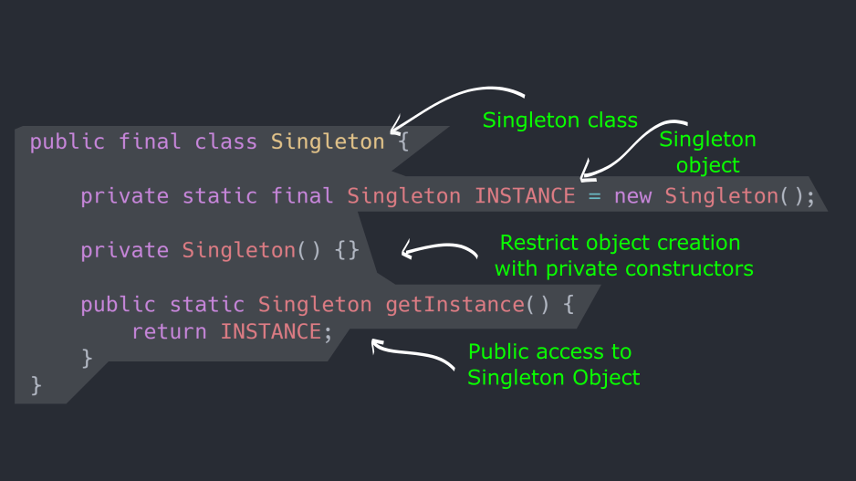

1. The Singleton design pattern is a creational design pattern that ensures a class has only one instance and provides a global point of access to that instance. In other words, it restricts the instantiation of a class to one object.

2. Key features of the Singleton pattern:

- Private Constructor: The class has a private constructor, preventing other classes from directly instantiating it.

- Static Instance: The class contains a static member variable that holds the single instance of the class.

- Static Method for Access: It provides a static method that acts as a global access point to the instance.

- Here's a simple example in Java:


```java
public class Singleton {
    private static Singleton instance;
    
    // Private constructor to prevent instantiation from outside
    private Singleton() {}
    
    // Static method to get the instance
    public static Singleton getInstance() {
        if(instance == null) {
            instance = new Singleton();
        }
        return instance;
    }    
}
```

3. This implementation ensures that only one instance of the Singleton class can be created, and it provides a way to access that instance globally via the getInstance() method. It's important to note that in a multithreaded environment, additional steps need to be taken to ensure thread safety, such as using synchronization or double-checked locking. Additionally, in some cases, lazy initialization might not be suitable, and eager initialization or other approaches might be preferred.


